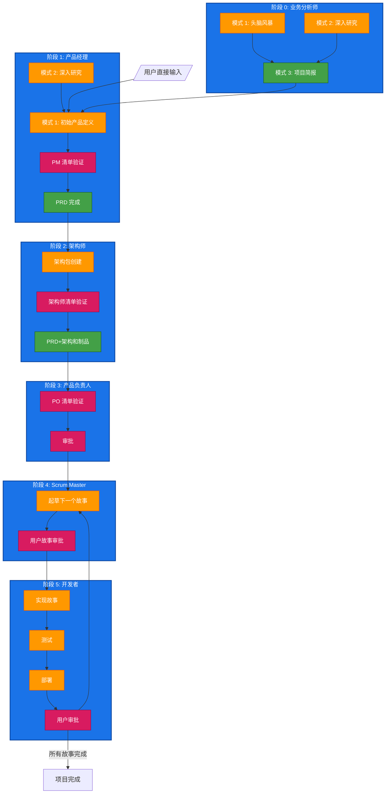

```mermaid
flowchart TD
    %% 阶段 0: 业务分析师
    subgraph BA["阶段 0: 业务分析师"]
        BA_B["模式 1: 头脑风暴"]
        BA_R["模式 2: 深入研究"]
        BA_P["模式 3: 项目简报"]

        BA_B --> BA_P
        BA_R --> BA_P
    end

    %% 阶段 1: 产品经理
    subgraph PM["阶段 1: 产品经理"]
        PM_D["模式 2: 深入研究"]
        PM_M["模式 1: 初始产品定义"]
        PM_C["PM 清单验证"]
        PM_PRD["PRD 完成"]

        PM_D --> PM_M
        PM_M --> PM_C
        PM_C --> PM_PRD
    end

    %% 阶段 2: 架构师
    subgraph ARCH["阶段 2: 架构师"]
        ARCH_P["架构包创建"]
        ARCH_C["架构师清单验证"]
        ARCH_D["PRD+架构和制品"]

        ARCH_P --> ARCH_C
        ARCH_C --> ARCH_D
    end

    %% 阶段 3: 产品负责人
    subgraph PO["阶段 3: 产品负责人"]
        PO_C["PO 清单验证"]
        PO_A["审批"]
    end

    %% 阶段 4: Scrum Master
    subgraph SM["阶段 4: Scrum Master"]
        SM_S["起草下一个故事"]
        SM_A["用户故事审批"]
    end

    %% 阶段 5: 开发者
    subgraph DEV["阶段 5: 开发者"]
        DEV_I["实现故事"]
        DEV_T["测试"]
        DEV_D["部署"]
        DEV_A["用户审批"]

        DEV_I --> DEV_T
        DEV_T --> DEV_D
        DEV_D --> DEV_A
    end

    %% 阶段之间的连接
    BA_P --> PM_M
    User_Input[/"用户直接输入"/] --> PM_M
    PM_PRD --> ARCH_P
    ARCH_D --> PO_C
    PO_C --> PO_A
    PO_A --> SM_S
    SM_S --> SM_A
    SM_A --> DEV_I
    DEV_A --> SM_S

    %% 完成条件
    DEV_A -- "所有故事完成" --> DONE["项目完成"]

    %% 样式
    classDef phase fill:#1a73e8,stroke:#0d47a1,stroke-width:2px,color:white,font-size:14px
    classDef artifact fill:#43a047,stroke:#1b5e20,stroke-width:1px,color:white,font-size:14px
    classDef process fill:#ff9800,stroke:#e65100,stroke-width:1px,color:white,font-size:14px
    classDef approval fill:#d81b60,stroke:#880e4f,stroke-width:1px,color:white,font-size:14px

    class BA,PM,ARCH,PO,SM,DEV phase
    class BA_P,PM_PRD,ARCH_D artifact
    class BA_B,BA_R,PM_D,PM_M,ARCH_P,SM_S,DEV_I,DEV_T,DEV_D process
    class PM_C,ARCH_C,PO_C,PO_A,SM_A,DEV_A approval
```
